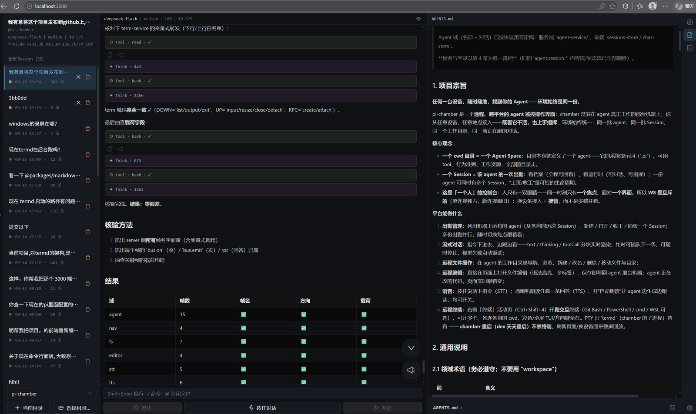
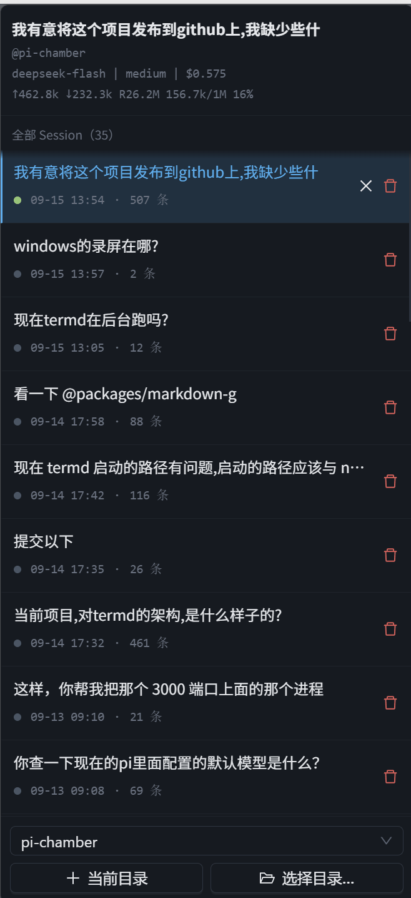
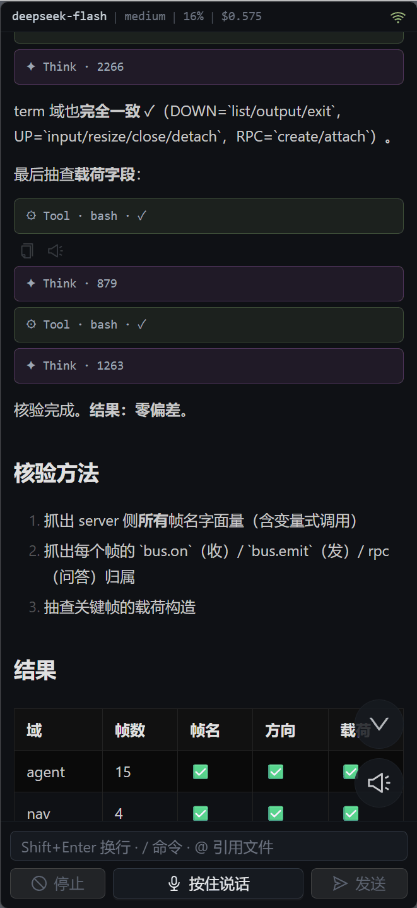
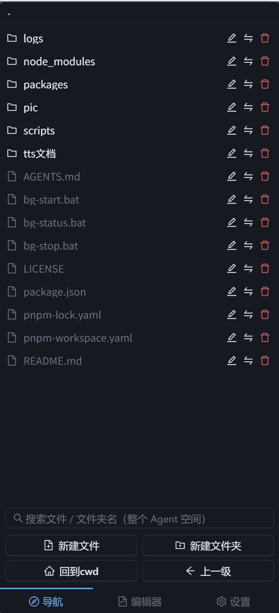

# pi-chamber

> **Your agent, from any device, anywhere — same environment, always.**

**[简体中文](./README.CH.md) · English**

pi-chamber is a **remote control room** for the [pi coding agent](https://pi.dev) (`@earendil-works/pi-coding-agent`). chamber runs on the machine where your agent actually works; you connect from any browser. **Watch it work, and take the wheel**: same agents, same sessions, same working directory, same live conversation.

<p align="center">
  
</p>
<p align="center"><em>Desktop — session list · streaming chat (thinking / tool calls collapsible) · file preview</em></p>

<p align="center">
  
  
  
</p>
<p align="center"><em>Mobile — session list · streaming chat · file navigation (same environment; connecting from a new device = taking over)</em></p>

## Core ideas

- **One cwd = one Agent Space.** A directory *is* an agent: its system prompt (`.pi`), its tools, its working resources — all of it travels with the directory.
- **One Session = one shift.** Every session has an archive (fully replayable) and a runtime (chat with it, steer it). One agent can have several shifts running; open / close / destroy is an explicit lifecycle.
- **This is a console for one person.** You have one pair of eyes, so there is **one focus** and **one interface** at a time. The WebSocket is therefore **exclusive** — a new connection kicks the old one. Connecting from another device means *taking over*, not watching in parallel.

## Features

| Capability | What it does |
|------|------|
| **Session management** | List every agent on the machine and all of its past sessions; create / open / close / destroy. Run several in parallel and switch focus at will |
| **Streaming chat** | text / thinking / tool calls rendered token by token; steer mid-run, abort any time; automatic retry on model failure |
| **Visible progress** | The agent writes its todo list down as it works (`todos` plugin); a progress bar and the current item render right above the input box, and collapse away when everything is done |
| **Remote file ops** | Browse the agent's working directory; create / rename / delete / move files and folders |
| **Remote editing** | Edit directly in the browser (CodeMirror, syntax highlighting, multiple tabs); save writes back to the agent's machine; external changes stream into the editor live |
| **Voice** | Hold to talk (STT); tap the speaker on any reply to read it aloud (TTS), or enable auto-read to follow along as the agent generates |
| **Remote terminal** | Real interactive terminals (Git Bash / PowerShell / cmd / WSL), as many as you want, each in its own cwd. The PTY belongs to `termd` — **restarting chamber does not kill your terminals**, and a page refresh replays the full screen |

## Quick start

```bash
pnpm install
# No config files to create: the first start generates ~/.pi/pi-chamber/pi-chamber-global-setting.json
# (random jwtSecret + default password demo123456 — printed to the console on first boot)

pnpm dev        # backend on 3001 (node --watch) + frontend on 5173 (vite HMR)
```

Open <http://localhost:5173> → log in with `demo123456` → **change it in Settings → Account**, then pick an Agent / create a Session → chat on the right.

Production:

```bash
pnpm build      # builds the frontend into packages/web/dist
pnpm start      # backend on 3000, serving the frontend
```

> Single user, password-only login (JWT, 7 day TTL).

## Caveats

### 1. Voice (STT / TTS) requires an Alibaba Cloud DashScope key

Both hold-to-talk and read-aloud go through **Alibaba Cloud Bailian (DashScope)** realtime speech services and each needs its own key:

- Turn the feature on and paste the key in **Settings → Read aloud** and **Settings → Speech recognition** (the two are configured independently — you can use the same key twice)
- **Without it**, the voice buttons are hidden/do nothing
- STT defaults to `fun-asr-realtime`; TTS defaults to `qwen-audio-3.0-tts-flash`
- Get a key from the [Bailian console](https://bailian.console.aliyun.com/) (there is a free tier)

### 2. Public deployments need HTTPS, or voice input won't work

Browsers only hand over the **microphone** (`getUserMedia`) in a **secure context** — `https://` or `localhost`. So:

- Visiting `http://192.168.x.x:3000` on your LAN → chat / terminal / editing all work, **but hold-to-talk does nothing**
- Want voice input → put Caddy / nginx in front with TLS (page over `https://`, WebSocket over `wss://`)

> Read-aloud (TTS) is unaffected — it only plays audio, it never touches the microphone.

## Package layout

Monorepo (pnpm workspaces, `node-linker=hoisted`):

| Package | Stack | Responsibility |
|----|------|------|
| `packages/bus` | zero-dependency pure ESM | `createBus` protocol machine + node/browser transports. The **single source of protocol truth** shared by both ends — never duplicated |
| `packages/server` | Express 5 + ws | HTTP only does login/me; agent domain (roster + chat), navigation, editor, voice, terminal frame bridging |
| `packages/web` | React 19 + antd 6 + zustand + Vite | The console: session panel / chat / navigation / editor / terminal / settings |
| `packages/termd` | node-pty + ws | The **terminal daemon**: a separate process and the only thing holding PTYs (see below) |

> Markdown rendering is **not in this repo** — it lives in its own npm package, [`@willianqrunning/markdown-go`](https://www.npmjs.com/package/@willianqrunning/markdown-go) (plugins for code highlighting / KaTeX / ECharts), which `packages/web` depends on directly.

## Architecture

### 1. Bus — one protocol, two delivery paths

`createBus()` is an in-process singleton (one on the server, one in the browser). **The transport is the only slot you plug into**, and the WebSocket is just the cable you plug in. Delivery comes in exactly two flavors:

- **Events (emit)** — one-way notification. Always delivered locally first; with `{net:true}` and a live connection, a copy also goes out over the wire. Nobody subscribed? Silently dropped.
- **Requests (request)** — question and answer. `net:false` asks locally only, `net:true` asks the other side only. No handler / disconnected / timed out → reject.

One JSON frame per line:

```
{t:"e", e, p}                 event
{t:"q", e, p, id}             request
{t:"s", id, ok:true,  data}   success receipt
{t:"s", id, ok:false, error}  failure receipt
```

### 2. termd — why the terminal is a separate process

PTY children live under whoever spawned them. If chamber spawned PTYs, every backend restart (and in dev it restarts constantly) would leave behind a pile of invisible, unkillable orphan shells. Handing them to a **separate, non-restarting process (`termd`)** means:

- Restarting chamber is just a reconnect: the frontend re-`attach`es and replays everything it missed;
- When termd exits, **it** kills all PTYs itself — it is the direct parent, and it is the only one that can do this cleanly.

termd binds `127.0.0.1:3002` only, speaks its own 40-line wire protocol (**it does not go through the bus**), and is protected by three layers of auth (see Security below).

### 3. Plugins — capabilities come from the directory, and switches are hot

Built-in capabilities are not hardcoded; they are **enabled per cwd**. That is the same principle as "one cwd = one Agent Space": **an agent's capabilities should be decided by the directory itself**.

There are two today:

- **`subagent`** — lets the agent hand a self-contained task to a **brand new, independent Session**. You get all of it for free: it shows up in the roster, you can open it and watch it stream, abort it, page through its history; it has its own archive and its own cost accounting.
- **`todos`** — gives the agent a **public todo list** (rendered above the input box with a progress bar and the current item).
  > Its role is "**the model reporting progress to the user**", *not* "the model managing itself". If you want to influence model behavior, put it in the tool description (the system prompt layer). **Never inject periodic reminders** — the cost is fake updates, and once the list isn't true, the whole panel is worthless.

Configuration lives in `<cwd>/.pi/pi-chamber.json`:

```json
{
  "subagent": {
    "enabled": true,
    "model": "ds/deepseek-flash",
    "maxConcurrent": 4,
    "timeoutMs": 360000
  },
  "todos": { "enabled": true }
}
```

**`enabled` defaults to `false`** — no config, no capability. Two reasons: delegating work costs money, so you should have to opt in; and zero migration cost, because no existing directory has to change.

A few deliberate trade-offs:

- **A separate file, not pi's `.pi/settings.json`** — that one is deep-merged across global + project layers and pi writes back to it, so custom keys stashed there risk being clobbered.
- **"Registration" and "activation" are two different things** — registration (does this tool exist at all) is fixed the moment a session is constructed; activation (is it live right now) can be recomputed any time. So plugin tools are **always registered**, and `enabled` only controls activation → **`/reload` hot-swaps the switch, no session restart needed** (the system prompt is rebuilt too).
  > The one thing you can't change on the fly: going from "this key doesn't exist" to "this key exists" — the registry doesn't know it yet, so you need one fresh Session. After that, every toggle is hot.
- **Tool names belong to chamber** — once a plugin's key appears in the config, the tool names it claims belong to chamber (they shadow same-named extensions in the agent directory). Otherwise installing an extension with the same name would bypass the plugin's own gate — which is exactly what keeps subagent recursion from escaping.

Adding a plugin = one `plugins/xxx.js` file + one line in the plugin table:

```js
export const key = "xxx";          // config key (the section name in pi-chamber.json)
export const toolNames = ["xxx"];  // tool names this plugin claims
export function create(ctx) { … }  // → ToolDefinition | null (null = don't inject this time, e.g. depth limit hit)
// optional (only for stateful plugins): extract this plugin's state from a toolResult, for restoring a session
export function stateOf(message) { … }
```

> The full contract, every `ctx` field and every trade-off lives in [`AGENTS.md`](./AGENTS.md) chapter 4 — that file is the spec for the agent, not human documentation (it's in Chinese; your agent reads it fine).

## Protocol at a glance

HTTP:

| Method | Path | Description |
|------|------|------|
| POST | `/api/login` | `{password}` → `{token}` |
| GET | `/api/me` | Bearer check (used as a liveness probe on frontend boot) |

WS `/ws?token=JWT` (exclusive connection, new one kicks the old, 60s heartbeat). Main frames:

- **Roster**: `agent.sessions.sync` (full) / `agent.sessions.patch` (delta) / `agent.sessions.list` (switch directory)
- **Chat**: `agent.chat.sync` (field-level replacement) / `agent.chat.message` / `agent.chat.delta` / `agent.chat.notice`
- **Lifecycle**: `agent.session.{open,close,create,delete,prompt,abort}`
- **Paging / full text**: `agent.chat.more_messages` · `agent.chat.toolResult` (request)
- **Plugin state**: `agent.plugin.state` (e.g. the todo list; pushed when a tool writes, on connect, and on open; `state:null` = this session is gone)
- **Navigation / files**: `nav.state` · `nav.update` · `nav.open` · `fs.{list,desktop,search,create,rename,delete,move}`
- **Editor**: `nav.open_file` · `editor.{update,files,file_changed,close_file}`
- **Voice**: `stt.{audio,end,partial,final,error}` · `tts.{speak,audio,finish,stop,end,break}`
- **Terminal**: `term.{list,create,attach,detach,output,input,resize,close,exit}`

> Complete field lists, semantics and trade-offs: [`AGENTS.md`](./AGENTS.md) chapter 4 — that file is the **single source of truth** for the protocol.

## Dev commands

```bash
pnpm dev            # backend 3001 + frontend 5173
pnpm dev:server     # backend only / pnpm dev:web for frontend only
pnpm build          # production frontend bundle
pnpm start          # production backend (3000)

pnpm test           # node --test (spins up its own instances on 3996~3999, never touches 3000/3001)
pnpm smoke          # end-to-end health check against a live server
pnpm agent-smoke    # agent domain: roster / lifecycle
pnpm prompt-smoke   # full prompt round-trip against a real model + frame semantics assertions
pnpm subagent-smoke # subagent domain (real model call: off by default / full path / /reload hot swap)
pnpm todos-smoke    # todos domain (real model call: off by default / state frames / archive restore / reconnect push)
pnpm web-smoke      # frontend store smoke: real frontend code consuming live frames under Node
pnpm termd-smoke    # terminal domain smoke (direct to termd)
pnpm term-smoke     # terminal domain smoke (full chamber path)

pnpm termd start|stop|status|restart   # the terminal daemon
pnpm bg start|stop|status|restart      # run the backend detached in the background
```

Logs live in `logs/` at the repo root (`dev` writes everything to `server.log`; production writes nothing, so streaming frames don't eat your disk).

## Security notes

- Built for a single user: the login password is stored **in plain text** in `~/.pi/pi-chamber/pi-chamber-global-setting.json` (`password`, next to `jwtSecret`).
  The default password on first boot is `demo123456` — **change it before exposing the server to a network**.
- `jwtSecret` and `password` are **never sent to the frontend** (`setting.sync` strips them).
- JWTs are stateless and non-revocable: logging out just means the frontend drops the token; a stolen token stays valid for its 7-day TTL. Acceptable for single-user use.
- Public deployment: put Caddy / nginx in front for TLS (`wss://`) — which also satisfies the HTTPS requirement for voice input (see Caveats).
- **termd never goes public**: it binds `127.0.0.1:3002` with three layers of auth — ① non-loopback rejected; ② **any connection carrying an `Origin` header (i.e. browser-initiated) is rejected**; ③ a token (24 random bytes, written to `packages/termd/data/token`). Getting that token means getting a shell on the machine.

## Background

The author is **not a professional developer** — he works in **finance**. Building this was partly scratching his own itch, partly learning.

Today's Codex / Claude Code / pi are built around **how coders work: sitting at a PC**. Most office workers don't work that way, and their interfaces look nothing like it. In finance, work often happens **in the field**: what you need is to **find your agent wherever you are**, and to **understand how it operates** well enough to trust it. Only then will you actually use it.

Most of the trade-offs in this project come from that premise.

### Why not opencode / openchamber?

Both are good projects. I tried opencode + openchamber seriously in February 2026 and got stuck on two things:

- **opencode's system prompt is not under your control** — and an agent's behavior is almost entirely determined by its system prompt, which means handing over the most important part.
- **openchamber's code was too complex** — I couldn't bend it to my needs.

### Why not Codex / Claude Code / WorkBuddy / Doubao Office?

They're all fine, and their ecosystems are rich. But they are **black boxes**:

- How the system prompt is assembled, how context is trimmed, how tools are scheduled — none of it is under your control;
- Subscription pricing means you **cannot measure real cost** (how many tokens did that one task actually burn? No idea).

**A great ecosystem has its own cost**: install enough plugins and skills and the agent has too many choices, which makes behavior *less* predictable — a whole class of problems comes from exactly there. pi is the opposite: system prompt, available tools, model, cost — all out in the open.

### Why not OpenClaw?

[OpenClaw](https://github.com/openclaw/openclaw) (🦞) is the multi-channel gateway that puts a pi agent on WhatsApp / Telegram / Discord / iMessage. It's a good project — for many people it's how they first met pi. But in my own use I kept hitting two walls:

- **The internals are too complex** — complex enough that you end up feeling **out of control**: when something goes wrong, you don't know where to look.
- **A chat app is a limited channel** — no streaming, so you can't tell what it's doing or how far along it is.

You rarely sit and watch a stream — but streaming gives you a **sense of control**. You know the agent is running; one glance at the thinking shows it's off the rails, and you can **stop it immediately**. LLMs today still don't deserve to be left completely unattended.

### Why session management?

pi itself doesn't manage concurrent sessions. But in real work, **running several tasks in parallel is not optional** — that was the most direct motivation for building this console.

Honestly: **I still can't walk away from my sessions.** When several are running, I still watch them.

I considered a "**butler mode**": talk to one main agent and demote everything else to subagents. Building it made it clear that neither today's LLM scheduling ability nor the way agents call each other is up to that model yet. So "many sessions, one focus" is the pragmatic middle ground for now.

### Roadmap

- **Scheduled tasks** — users can already do this with pi ecosystem plugins; chamber's job is just the management UI;
- **Remote notifications** — "the agent finished and pushed it to your phone" needs a real app. Plain web can't do it.

## License

[MIT](./LICENSE)
